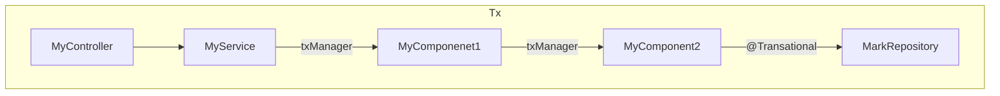

# Spring Boot Transaction Manager with @Transactional

### Objective

* Achieve transaction commit even after exception using `noRollbackFor`
* Transaction propagation with local scope protection using `Propagation.REQUIRES_NEW` from
  external `transactionManager`

### How to run

To execute locally -

* Run postgres using docker  
  `docker run --name some-postgres -e POSTGRES_PASSWORD=root -p 5432:5432 -d postgres`

* Run spring boot using maven  
  `mvn spring-boot:run`

### Endpoints

* `GET /mark/{willFail}`  
Path Variable `willFail` will force the application to throw ETLException (see Exceptions below)

### Exceptions

* ETLException - thrown when `willFail` is set to `true`. This exception is ignored in local transaction rollback.
  However, the exception will propagate to controller advice.
* MyException - thrown when 'willFail' is set to 'false'. This will be rollback in local translation itself.

### Bean Injection Map

